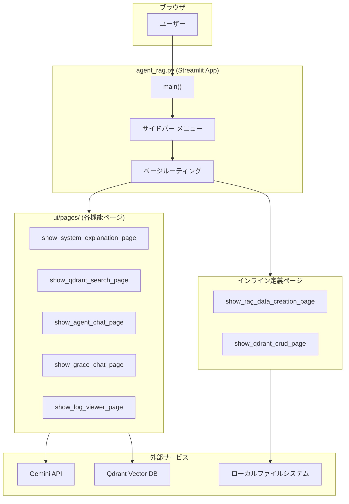
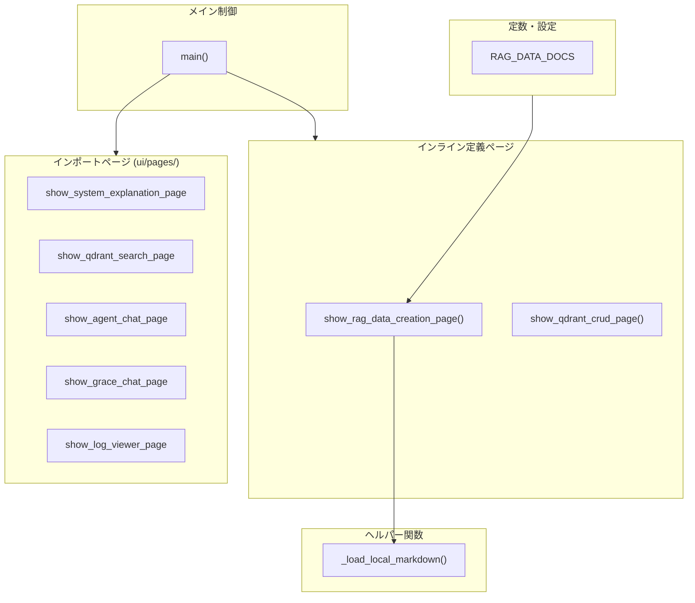
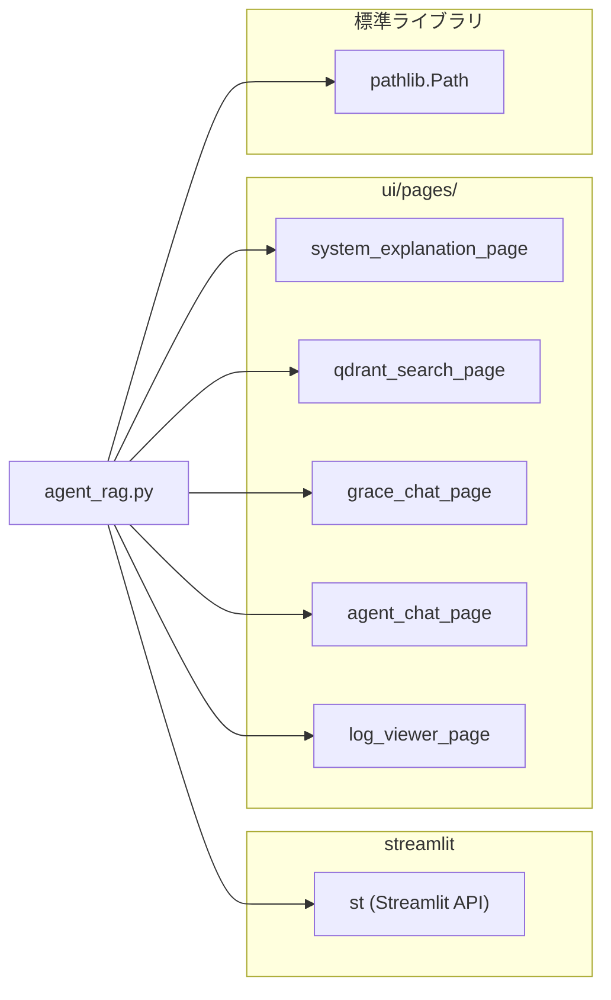

## agent_rag.py - Streamlit メインアプリケーション ドキュメント

**Version 3.0** | 最終更新: 2026-03-19


| Phase | モジュール | subgraph |
|:---|:---|:---|
| Phase 1 | config.py + schemas.py | 基盤（最上部） |
| Phase 2 | planner.py | 計画生成 |
| Phase 3 | executor.py | 実行ループ（外枠） |
| ├ (B) | tools.py | ツール実行 |
| ├ (C) | confidence.py | 信頼度計算 |
| ├ (D) | executor.py 内 D案 | RAG適合性判定 |
| ├ (E) | intervention.py | HITL介入 |
| ├ (F) | replan.py | 動的リプラン |
| └ 終了後 | confidence.py | 全体信頼度集計 |


| Phase | モジュール | 説明 |
|:---|:---|:---|
| [0] | config.py | 設定管理（全モジュールが参照） |
| [0] | schemas.py | データモデル定義（全モジュールが参照） |
| [1] | planner.py | 計画生成（最初に実行） |
| [2] | tools.py | ツール定義（Executor が呼び出す道具箱） |
| [3] | executor.py | 計画実行（中核エンジン） |
| [4] | confidence.py | 信頼度計算（各ステップ実行後に評価） |
| [5] | intervention.py | HITL 介入（信頼度が低い場合に発動） |
| [6] | replan.py | 動的リプラン（失敗・低信頼度時に再計画） |
| - | \_\_init\_\_.py | パッケージ公開 API |

---

## 目次

1. [概要](#概要)
2. [アーキテクチャ構成図](#1-アーキテクチャ構成図)
3. [モジュール構成図](#2-モジュール構成図)
4. [クラス・関数一覧表](#3-クラス関数一覧表)
5. [クラス・関数 IPO詳細](#4-クラス関数-ipo詳細)
6. [設定・定数](#5-設定定数)
7. [使用例](#6-使用例)
8. [変更履歴](#8-変更履歴)
9. [付録: 依存関係図](#付録-依存関係図)

---

## 概要

`agent_rag.py`は、Agent RAG（Gemini）プロジェクトの Streamlit メインアプリケーションです。サイドバーのメニューからページを選択し、各機能ページを動的に切り替えて表示するルーティング制御を担います。

実行コマンド：
```bash
streamlit run agent_rag.py --server.port 8501
```

### 主な責務

- Streamlit ページ設定（タイトル・アイコン・レイアウト）の初期化
- サイドバーのメニュー構築とページルーティング
- 各機能ページモジュールの呼び出し・表示切替
- RAGデータ作成ページのローカルMarkdownドキュメント読み込み・表示
- Qdrant CRUD ページの仮実装（プレースホルダー）

### 各責務対応のモジュール

| # | 責務 | 対応モジュール | 説明 |
|---|------|--------------|------|
| 1 | ページ設定・ルーティング | `agent_rag.py` (`main()`) | `st.set_page_config` + `st.radio` によるページ切替 |
| 2 | システム説明ページ | `ui/pages/system_explanation_page.py` | プロジェクト概要の表示 |
| 3 | Qdrant検索ページ | `ui/pages/qdrant_search_page.py` | ベクトルDB検索 + LLM回答生成 |
| 4 | Agent(ReAct+Reflection)チャット | `ui/pages/agent_chat_page.py` | 旧型エージェントチャット |
| 5 | 自律型Agent(GRACE)チャット | `ui/pages/grace_chat_page.py` | Planner+Executor 2フェーズエージェント |
| 6 | ログビューア | `ui/pages/log_viewer_page.py` | 未回答ログの確認 |
| 7 | RAGデータ作成ページ | `agent_rag.py` (`show_rag_data_creation_page()`) | ドキュメント表示（インライン定義） |
| 8 | Qdrant CRUDページ | `agent_rag.py` (`show_qdrant_crud_page()`) | CRUD操作（仮実装） |

### 主要機能一覧

| 機能 | 説明 |
|------|------|
| `main()` | メインアプリケーション。ページ設定・サイドバー・ルーティングの統合制御 |
| `show_rag_data_creation_page()` | RAGデータ作成ページの表示（関連ドキュメント参照テーブル + Expander） |
| `show_qdrant_crud_page()` | Qdrant CRUD操作ページの表示（仮実装） |
| `_load_local_markdown()` | プロジェクト内のMarkdownファイルを読み込むヘルパー関数 |
| `RAG_DATA_DOCS` | RAGデータ作成関連ドキュメントの定義リスト（定数） |

---

## 1. アーキテクチャ構成図

### 1.1 システム全体構成



### 1.2 データフロー

1. ユーザーがブラウザでアプリにアクセス
2. `main()` が `st.set_page_config` でページ設定を初期化
3. サイドバーの `st.radio` でユーザーがページを選択
4. `page_mapping` 辞書から対応する関数を取得して呼び出し
5. 選択されたページが Gemini API / Qdrant / ローカルファイルと連携して結果を表示

---

## 2. モジュール構成図

### 2.1 内部モジュール構成



### 2.2 外部依存関係

| ライブラリ | バージョン | 用途 |
|-----------|-----------|------|
| `streamlit` | >= 1.28 | UIフレームワーク |
| `pathlib` | 標準ライブラリ | ローカルファイルパス操作 |

### 2.3 内部依存モジュール

| モジュール | 用途 |
|-----------|------|
| `ui.pages.show_system_explanation_page` | システム説明ページ表示 |
| `ui.pages.show_qdrant_search_page` | Qdrant検索ページ表示 |
| `ui.pages.show_grace_chat_page` | GRACE自律型エージェントチャットページ表示 |
| `ui.pages.agent_chat_page.show_agent_chat_page` | ReAct+Reflectionエージェントチャットページ表示 |
| `ui.pages.log_viewer_page.show_log_viewer_page` | 未回答ログビューアページ表示 |

---

## 3. クラス・関数一覧表

### 3.1 関数一覧

#### メイン制御

| 関数名 | 概要 |
|-------|------|
| `main()` | アプリケーションのエントリポイント。ページ設定・サイドバー・ルーティング |

#### ページ表示

| 関数名 | 概要 |
|-------|------|
| `show_rag_data_creation_page()` | RAGデータ作成ページの表示 |
| `show_qdrant_crud_page()` | Qdrant CRUD操作ページの表示（仮実装） |

#### ヘルパー

| 関数名 | 概要 |
|-------|------|
| `_load_local_markdown(file_path)` | ローカルMarkdownファイルの読み込み |

---

## 4. クラス・関数 IPO詳細

### 4.1 `main`

**概要**: メインアプリケーション関数。Streamlitのページ設定、サイドバーのメニュー構築、ページルーティングを統合制御する。

```python
def main() -> None
```

| 項目 | 内容 |
|------|------|
| **Input** | なし（Streamlitセッション状態から取得） |
| **Process** | 1. `st.set_page_config` でページ設定（タイトル: "Agent RAG(Gemini)", アイコン: 🤖, レイアウト: wide）<br>2. `st.sidebar` 内にタイトル・メニューを描画<br>3. `st.radio` で7つのページ選択肢を表示（`format_func` でラベル変換）<br>4. `page_mapping` 辞書から選択されたページの関数を取得<br>5. 対応する関数を呼び出してメインエリアに描画 |
| **Output** | なし（画面描画のみ） |

**ページルーティング定義**:

| キー | 表示ラベル | 対応関数 |
|------|-----------|---------|
| `explanation` | 📖 説明 | `show_system_explanation_page` |
| `qdrant_search` | 🔎 Qdrant検索 | `show_qdrant_search_page` |
| `agent_chat` | 🤖 Agent(ReAct+Reflection) | `show_agent_chat_page` |
| `grace_chat` | [最新] 自律型Agent(Plan+Executor) | `show_grace_chat_page` |
| `log_viewer` | 📊 未回答ログ | `show_log_viewer_page` |
| `rag_data_creation` | 📄 RAGデータ作成 | `show_rag_data_creation_page` |
| `qdrant_crud` | 🗄️ QdrantのCRUD | `show_qdrant_crud_page` |

**使用例**:

```python
# エントリポイント
if __name__ == "__main__":
    main()
```

---

### 4.2 `show_rag_data_creation_page`

**概要**: RAGデータ作成ページを表示する。関連ドキュメントの参照テーブルと、各ドキュメントのExpanderによる内容プレビュー、RAGデータ作成フローの説明を含む。

```python
def show_rag_data_creation_page() -> None
```

| 項目 | 内容 |
|------|------|
| **Input** | なし（`RAG_DATA_DOCS` 定数を参照） |
| **Process** | 1. `st.header` で「📄 RAGデータ作成」を表示<br>2. `RAG_DATA_DOCS` からMarkdownテーブルを動的生成<br>3. 各ドキュメントを `st.expander` 内に `_load_local_markdown()` で読み込み表示<br>4. RAGデータ作成フロー（チャンク分割→Q/A作成→Qdrant登録）をMarkdownで説明 |
| **Output** | なし（画面描画のみ） |

---

### 4.3 `show_qdrant_crud_page`

**概要**: Qdrant CRUD操作ページを表示する（仮実装）。Create / Read / Update / Delete の主要機能を説明テキストとして表示する。

```python
def show_qdrant_crud_page() -> None
```

| 項目 | 内容 |
|------|------|
| **Input** | なし |
| **Process** | 1. `st.header` で「🗄️ QdrantのCRUD」を表示<br>2. Markdown形式でCRUD操作の概要を説明 |
| **Output** | なし（画面描画のみ） |

> 📝 **注意**: 現時点では仮実装。実際のCRUD操作UIは未実装。

---

### 4.4 `_load_local_markdown`

**概要**: プロジェクト内のMarkdownファイルを読み込むヘルパー関数。ファイルが存在しない場合は警告メッセージを返す。

```python
def _load_local_markdown(file_path: str) -> str
```

| パラメータ | 型 | デフォルト | 説明 |
|------------|------|-----------|------|
| `file_path` | `str` | - | 読み込むMarkdownファイルのパス（プロジェクトルートからの相対パス） |

| 項目 | 内容 |
|------|------|
| **Input** | `file_path: str` — Markdownファイルのパス |
| **Process** | 1. `pathlib.Path` でパスオブジェクトを生成<br>2. `p.exists()` でファイル存在確認<br>3. 存在する場合は `p.read_text(encoding="utf-8")` でUTF-8読み込み<br>4. 存在しない場合は警告メッセージ文字列を返却 |
| **Output** | `str`: Markdownファイルの内容、またはファイル未存在時の警告メッセージ |

**戻り値例**:

```python
# ファイルが存在する場合
"# ドキュメントタイトル\n\n本文の内容..."

# ファイルが存在しない場合
"⚠️ ファイルが見つかりません: `path/to/file.md`"
```

**使用例**:

```python
# 使用例
content = _load_local_markdown("readme_usage_tools.md")
st.markdown(content)
```

---

## 5. 設定・定数

### 5.1 RAG_DATA_DOCS

RAGデータ作成関連ドキュメントの定義リスト。各エントリは `path`（ファイルパス）と `description`（説明文）を持つ辞書。

```python
RAG_DATA_DOCS = [
    {
        "path"       : "readme_usage_tools.md",
        "description": "[tools]：ツールの使い方（RAGデータ作成はCLIの下記コマンドを利用します）",
    },
    {
        "path": "chunking/doc/csv_text_to_chunks_text_csv.md",
        "description": "[チャンク分割]：LLMベース - 3段階セマンティックチャンキング - パイプラインの仕様書",
    },
    {
        "path": "qa_qdrant/doc/make_qa_register_qdrant.md",
        "description": "[Q/A生成＋Qdrant登録]： 統合CLIツールの仕様書",
    },
]
```

| キー | 型 | 説明 |
|-----|------|------|
| `path` | `str` | プロジェクトルートからのMarkdownファイルパス |
| `description` | `str` | ドキュメントの説明文（UIテーブルに表示） |

---

## 6. 使用例

### 6.1 基本的な起動

```bash
# ローカル起動
streamlit run agent_rag.py --server.port 8501

# GCPサーバーでの起動（systemd経由）
sudo systemctl start streamlit-app

# 状態確認
sudo systemctl status streamlit-app

# ログ確認
journalctl -u streamlit-app -f
```

### 6.2 リモートサーバー管理

```bash
# SSH接続
ssh -i ~/.ssh/gcp_key_v2 nakashima@34.84.198.115

# 再起動
sudo systemctl restart streamlit-app

# 設定変更後
sudo systemctl daemon-reload
sudo systemctl restart streamlit-app
```

---

## 8. 変更履歴

| バージョン | 変更内容 |
|-----------|---------|
| 1.0 | 初版作成。基本的なページルーティング |
| 2.0 | GRACE自律型エージェントページ追加。ログビューアページ追加 |
| 3.0 | RAGデータ作成ページ追加。Qdrant CRUDページ追加（仮実装）。メニュー構成を7ページに拡張 |

---

## 付録: 依存関係図


